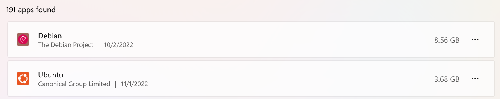

  
# Intro
如果你按照正常方式在设置里移动wsl的话就会发现报错，本篇文章向您介绍如何正确迁移以及回收空间。
# 移动
在Windows的PowerShell中输入:
```cmd cmd
wsl --help
```
可以看到关于这个命令的使用帮助说明：
```cmd cmd
用法: wsl.exe [参数] [选项...] [命令行]
 
用于运行 Linux 二进制文件的参数:
 
    如果未提供命令行，wsl.exe 将启动默认的 shell。
    --exec, -e <命令行>
        执行指定的命令而不使用默认的 Linux shell。
    --
        按原样传递剩余的命令行。
选项:
    --distribution, -d <分发版>
        运行指定的分发。
    --user, -u <用户名>
        以指定用户身份运行。
用于管理适用于 Linux 的 Windows 子系统的参数:
 
    --export <分发版> <文件名>
        将分发导出到 tar 文件。
        对于标准输出，文件名可以是 -。
    --import <分发版> <安装位置> <文件名> [选项]
        将指定的 tar 文件作为新分发进行导入。
        对于标准输入，文件名可以是 -。
        选项:
            --version <版本>
                指定用于新分发的版本。
    --list, -l [选项]
        列出分发。
        选项:
            --all
                列出所有分发，包括当前正在
                安装或卸载的分发。
            --running
                只列出当前正在运行的分发。
            --quiet, -q
                只显示分发名称。
            --verbose, -v
                显示有关所有分发的详细信息。
    --set-default, -s <分发版>
        将分发设置为默认值。
    --set-default-version <版本>
        更改新分发的默认安装版本。
    --set-version <分发版> <版本>
        更改指定分发的版本。
    --shutdown
        立即终止所有正在运行的分发和 WSL 2 轻型工具虚拟机。
    --terminate, -t <分发版>
        终止指定的分发。
    --unregister <分发版>
        注销分发。
    --help
        显示用法信息。
```
这里我们使用到export 、unregister和import几个选项就可以实现迁移。
1. 终止正在运行的分发或虚拟机：
   ```cmd cmd
   wsl --shutdown
   ```
2. 查看已安装的wsl名称：
   ```cmd cmd
   wsl.exe --list --all
   ```
   ```cmd cmd
   适用于 Linux 的 Windows 子系统分发:
   Debian (默认)
   kali-linux
   Ubuntu
   ```
3. 对需要迁移的分发或虚拟机导出（我要迁移kali-linux）：
   ```cmd cmd
   wsl --export kali-linux D:\kali
   ```
4. 卸载分发版或虚拟机（如果是要重装系统或换机器安装，这一步可以省略，但是要将上一步导出的文件保存好）
   ```cmd cmd
   wsl --unregister kali-linux
   ```
5. 导入新的分发版或虚拟机：
   ```cmd cmd
   wsl --import kali-linux D:\wsl\kali D:\kali
   ```

# 压缩
等待导入后你会发现移动的其实是vhdx文件，那么就可以对这个文件进行回收空间。
1. 以管理员身份运行cmd，输入diskpart命令按回车。
2. 使用以下命令选择你的userdata.vhdx
```cmd cmd
select vdisk file = "D:\wsl\ext4.vhdx"
```
如果提示
```cmd cmd
DiskPart successfully selected the virtual disk file.
```
就说明成功了。

3. 输入 `compact vdisk` 来压缩。

# bug
```cmd cmd
ERROR: Wsl/Service/CreateInstance/ERROR_FILE_NOT_FOUND
```cmd cmd
打开命令行，在命令行中输入
```
wsl.exe --list --all
wsl.exe --unregister xxx
```

# 摘抄
[WSL2迁移方法](https://blog.csdn.net/zhys2007/article/details/110958577)
[解决Win10子系统的Ubuntu被删除后，重新安装出现找不到系统路径](https://blog.csdn.net/y17854117512/article/details/119214442?spm=1001.2101.3001.6661.1&utm_medium=distribute.pc_relevant_t0.none-task-blog-2%7Edefault%7ECTRLIST%7Edefault-1-119214442-blog-110900591.pc_relevant_default&depth_1-utm_source=distribute.pc_relevant_t0.none-task-blog-2%7Edefault%7ECTRLIST%7Edefault-1-119214442-blog-110900591.pc_relevant_default&utm_relevant_index=1)